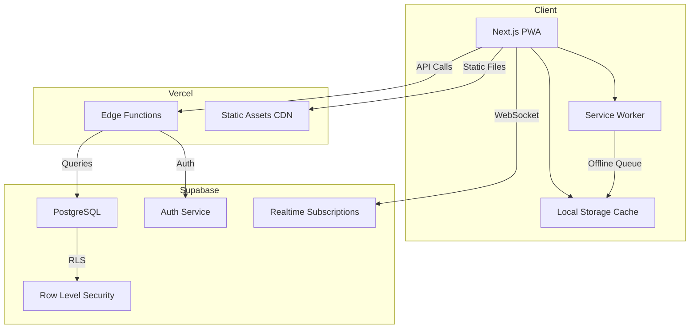
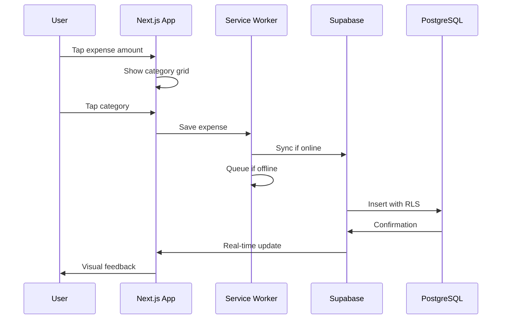
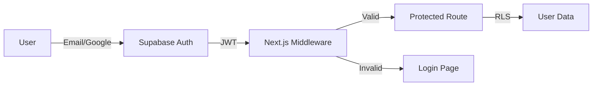

# PLANNING.md - Budget Tracker Application

## 🎯 Vision & Mission

### Vision Statement
Créer l'application de gestion budgétaire la plus rapide et intuitive du marché, où chaque dépense peut être enregistrée en moins de 5 secondes, permettant aux utilisateurs de maintenir leurs finances personnelles sans friction ni effort cognitif.

### Mission
Éliminer toute barrière entre l'intention d'enregistrer une dépense et son enregistrement effectif, en créant une expérience utilisateur si fluide qu'elle devient une habitude naturelle plutôt qu'une corvée.

### Core Values
1. **Simplicité radicale** - Si une fonctionnalité nécessite une explication, elle est trop complexe
2. **Vitesse obsessionnelle** - Chaque milliseconde compte
3. **Mobile-only mindset** - Le desktop est un bonus, pas une priorité
4. **Privacy-first** - Les données financières sont sensibles et privées
5. **Offline-capable** - L'app doit fonctionner partout, tout le temps

### Target Metrics
- ⏱️ Temps d'ajout d'une dépense : < 5 secondes
- 📱 Taille de l'app : < 500KB gzipped
- 🚀 Time to Interactive : < 3 secondes sur 3G
- 💯 Lighthouse Score : > 95 sur mobile
- 🔄 Sync latency : < 500ms

## 🏗️ Architecture

### System Architecture



### Data Flow Architecture



### Component Architecture

```
┌─────────────────────────────────────┐
│           Root Layout               │
│  (Providers, Theme, Global State)   │
└─────────────┬───────────────────────┘
              │
    ┌─────────┴─────────┐
    │                   │
┌───▼────┐        ┌────▼────┐
│  Auth  │        │Protected│
│ Layout │        │  Layout │
└───┬────┘        └────┬────┘
    │                  │
┌───▼───┐    ┌────────┼─────────────────┐
│ Login │    │        │                  │
└───────┘  ┌─▼──┐  ┌─▼──┐  ┌──────┐  ┌─▼──┐
           │Dash│  │Exp.│  │History│  │Set.│
           │board│ │Entry│ └──────┘  └────┘
           └────┘  └────┘
```

### Database Schema Design

```sql
-- Core domain model with optimized indexes
┌─────────────┐     ┌──────────────┐     ┌──────────────┐
│  categories │────<│   expenses   │>────│recurring_exp │
└─────────────┘     └──────────────┘     └──────────────┘
       │                    │                     │
       │                    │                     │
       ▼                    ▼                     │
┌─────────────┐     ┌──────────────┐            │
│   budgets   │     │favorite_cats │            │
└─────────────┘     └──────────────┘            │
       │                    │                     │
       └────────────────────┴─────────────────────┘
                            │
                         [user_id]
```

## 💻 Technology Stack

### Frontend Stack

| Technology | Version | Purpose | Why this choice |
|------------|---------|---------|-----------------|
| **Next.js** | 14.2+ | React Framework | App Router, RSC, Built-in optimizations |
| **React** | 18.3+ | UI Library | Concurrent features, Suspense |
| **TypeScript** | 5.5+ | Type Safety | Prevent runtime errors, Better DX |
| **Tailwind CSS** | 3.4+ | Styling | Mobile-first utilities, Small bundle |
| **shadcn/ui** | Latest | Components | Accessible, Customizable, Copy-paste |
| **Radix UI** | Latest | Primitives | Accessibility, Unstyled components |
| **React Hook Form** | 7.52+ | Forms | Performance, Validation |
| **Zod** | 3.23+ | Validation | Type-safe schemas |
| **Zustand** | 4.5+ | State | Simple, Fast, Small |
| **TanStack Query** | 5.50+ | Data Fetching | Cache, Optimistic updates |
| **date-fns** | 3.6+ | Date utils | Tree-shakeable, Immutable |
| **Framer Motion** | 11.3+ | Animations | Gestures, Spring physics |

### Backend Stack

| Technology | Version | Purpose | Why this choice |
|------------|---------|---------|-----------------|
| **Supabase** | Latest | BaaS | Auth, DB, Realtime, RLS |
| **PostgreSQL** | 15+ | Database | ACID, JSON support, Performance |
| **PostgREST** | Latest | API | Auto-generated from schema |
| **Vercel** | Latest | Hosting | Edge functions, Global CDN |
| **Edge Runtime** | Latest | API Routes | Low latency, Global |

### Development Stack

| Tool | Version | Purpose |
|------|---------|---------|
| **Node.js** | 20 LTS | Runtime |
| **pnpm** | 9.5+ | Package Manager |
| **Biome** | 1.8+ | Linter/Formatter |
| **Vitest** | 2.0+ | Unit Testing |
| **Playwright** | 1.45+ | E2E Testing |
| **Storybook** | 8.2+ | Component Development |

## 🛠️ Required Tools & Setup

### Development Environment

#### 1. Core Requirements
```bash
# Node.js (v20 LTS)
curl -fsSL https://fnm.vercel.app/install | bash
fnm use 20

# pnpm (Fast, disk space efficient)
npm install -g pnpm

# Supabase CLI
brew install supabase/tap/supabase  # macOS
# or
npm install -g supabase
```

#### 2. Code Editor Setup
```json
// VS Code Extensions Required
{
  "recommendations": [
    "bradlc.vscode-tailwindcss",        // Tailwind IntelliSense
    "dbaeumer.vscode-eslint",           // ESLint
    "biomejs.biome",                    // Biome formatter
    "prisma.prisma",                    // Prisma syntax
    "esbenp.prettier-vscode",           // Prettier
    "usernamehw.errorlens",             // Inline errors
    "formulahendry.auto-rename-tag",    // HTML tag rename
    "christian-kohler.path-intellisense" // Path autocomplete
  ]
}
```

#### 3. Browser Extensions
- React Developer Tools
- Lighthouse
- WAVE (accessibility)
- Mobile simulator

### Project Initialization

```bash
# 1. Create Next.js app with TypeScript
pnpm create next-app@latest budget-tracker \
  --typescript \
  --tailwind \
  --app \
  --src-dir \
  --import-alias "@/*"

cd budget-tracker

# 2. Install dependencies
pnpm add @supabase/supabase-js @supabase/ssr
pnpm add @tanstack/react-query zustand
pnpm add react-hook-form zod @hookform/resolvers
pnpm add date-fns framer-motion
pnpm add lucide-react
pnpm add -D @types/node

# 3. Install shadcn/ui
pnpm dlx shadcn-ui@latest init
pnpm dlx shadcn-ui@latest add button card dialog drawer form input label

# 4. Setup Supabase
supabase init
supabase login
supabase link --project-ref your-project-ref

# 5. Setup environment variables
cp .env.example .env.local
```

### Environment Configuration

```env
# .env.local
NEXT_PUBLIC_SUPABASE_URL=https://[PROJECT_REF].supabase.co
NEXT_PUBLIC_SUPABASE_ANON_KEY=your-anon-key
NEXT_PUBLIC_APP_URL=http://localhost:3000

# .env.production
NEXT_PUBLIC_SUPABASE_URL=https://[PROJECT_REF].supabase.co
NEXT_PUBLIC_SUPABASE_ANON_KEY=your-anon-key
NEXT_PUBLIC_APP_URL=https://your-domain.vercel.app
```

### Supabase Configuration

```sql
-- 1. Enable required extensions
CREATE EXTENSION IF NOT EXISTS "uuid-ossp";
CREATE EXTENSION IF NOT EXISTS "pg_cron";

-- 2. Setup RLS policies
ALTER TABLE budgets ENABLE ROW LEVEL SECURITY;
ALTER TABLE expenses ENABLE ROW LEVEL SECURITY;
ALTER TABLE recurring_expenses ENABLE ROW LEVEL SECURITY;
ALTER TABLE favorite_categories ENABLE ROW LEVEL SECURITY;

-- 3. Create functions for business logic
CREATE OR REPLACE FUNCTION update_favorite_categories()
RETURNS TRIGGER AS $$
BEGIN
  -- Update favorite categories based on usage
  -- Implementation here
  RETURN NEW;
END;
$$ LANGUAGE plpgsql;

-- 4. Setup cron jobs for recurring expenses
SELECT cron.schedule(
  'insert-recurring-expenses',
  '0 0 1 * *', -- First day of month at midnight
  $$INSERT INTO expenses...$$
);
```

### Vercel Deployment Setup

```json
// vercel.json
{
  "framework": "nextjs",
  "buildCommand": "pnpm build",
  "installCommand": "pnpm install",
  "regions": ["cdg1"], // Paris region for EU users
  "functions": {
    "app/api/*": {
      "runtime": "edge"
    }
  }
}
```

## 📊 Performance Budget

### Bundle Size Targets
- Initial JS: < 100KB
- First Load JS: < 200KB
- CSS: < 50KB
- Fonts: 0 (use system fonts)
- Images: < 100KB total (icons only)

### Web Vitals Targets
- LCP: < 2.5s
- FID: < 100ms
- CLS: < 0.1
- TTFB: < 600ms
- FCP: < 1.8s

### Resource Hints
```html
<!-- Preconnect to critical origins -->
<link rel="preconnect" href="https://[project].supabase.co">
<link rel="dns-prefetch" href="https://[project].supabase.co">

<!-- Preload critical resources -->
<link rel="preload" as="font" type="font/woff2" crossorigin href="/fonts/inter.woff2">
```

## 🔒 Security Considerations

### Authentication Flow


### Security Checklist
- [ ] RLS enabled on all tables
- [ ] API routes use authentication middleware
- [ ] Environment variables properly scoped
- [ ] CORS configured for production domain
- [ ] Rate limiting on API endpoints
- [ ] Input validation with Zod schemas
- [ ] XSS protection via React
- [ ] CSRF protection via SameSite cookies
- [ ] SQL injection prevented via parameterized queries

## 🚀 Deployment Pipeline

### CI/CD Workflow
```yaml
# .github/workflows/deploy.yml
name: Deploy
on:
  push:
    branches: [main]
  pull_request:
    branches: [main]

jobs:
  test:
    runs-on: ubuntu-latest
    steps:
      - uses: actions/checkout@v4
      - uses: pnpm/action-setup@v3
      - run: pnpm install
      - run: pnpm test
      - run: pnpm build

  deploy:
    needs: test
    if: github.ref == 'refs/heads/main'
    runs-on: ubuntu-latest
    steps:
      - uses: amondnet/vercel-action@v25
        with:
          vercel-token: ${{ secrets.VERCEL_TOKEN }}
          vercel-org-id: ${{ secrets.ORG_ID }}
          vercel-project-id: ${{ secrets.PROJECT_ID }}
```

### Monitoring & Analytics

#### Performance Monitoring
- Vercel Analytics (Web Vitals)
- Sentry (Error tracking)
- LogRocket (Session replay)

#### Business Metrics
- Mixpanel/Plausible (Privacy-friendly analytics)
- Custom Supabase functions for usage metrics

## 📱 PWA Configuration

### Manifest
```json
{
  "name": "Budget Tracker",
  "short_name": "Budget",
  "description": "Simple expense tracking",
  "theme_color": "#10B981",
  "background_color": "#ffffff",
  "display": "standalone",
  "orientation": "portrait",
  "scope": "/",
  "start_url": "/",
  "icons": [
    {
      "src": "/icon-192.png",
      "sizes": "192x192",
      "type": "image/png"
    },
    {
      "src": "/icon-512.png",
      "sizes": "512x512",
      "type": "image/png"
    }
  ]
}
```

### Service Worker Strategy
- Cache First: Static assets
- Network First: API calls
- Stale While Revalidate: Dashboard data
- Background Sync: Offline expense queue

## 🎯 Success Criteria

### Technical Success
- ✅ All Lighthouse scores > 95
- ✅ Zero runtime errors in production
- ✅ 100% uptime (excluding maintenance)
- ✅ < 1% failed API requests

### User Success
- ✅ 80% of expenses added in < 5 seconds
- ✅ 90% mobile usage vs desktop
- ✅ < 2% bounce rate on dashboard
- ✅ 50%+ daily active users

### Business Success
- ✅ 1000+ MAU within 6 months
- ✅ 4.5+ app store rating
- ✅ < $10/month infrastructure costs
- ✅ 60%+ user retention after 30 days

## 📚 References & Resources

### Documentation
- [Next.js Documentation](https://nextjs.org/docs)
- [Supabase Documentation](https://supabase.com/docs)
- [Tailwind CSS](https://tailwindcss.com/docs)
- [shadcn/ui](https://ui.shadcn.com)

### Learning Resources
- [Epic Web Dev](https://epicweb.dev) - Full-stack best practices
- [Web.dev](https://web.dev) - Performance guidelines
- [A11y Project](https://a11yproject.com) - Accessibility

### Design Inspiration
- [Mobbin](https://mobbin.com) - Mobile UI patterns
- [Page Flows](https://pageflows.com) - User flow examples
- [UI Movement](https://uimovement.com) - Micro-interactions